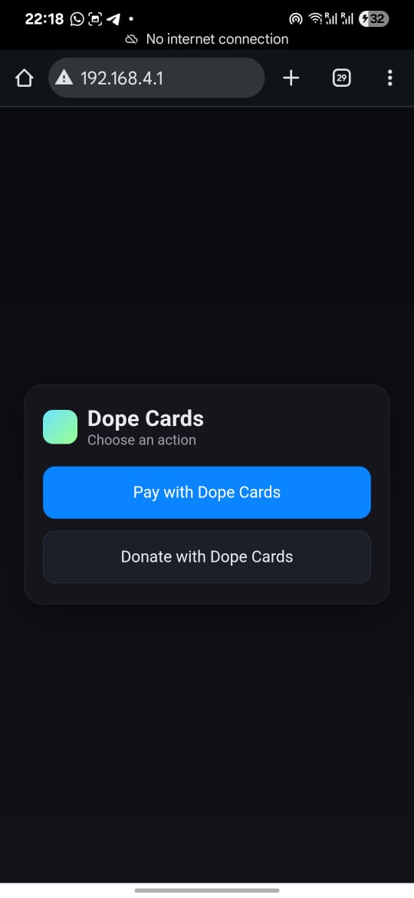
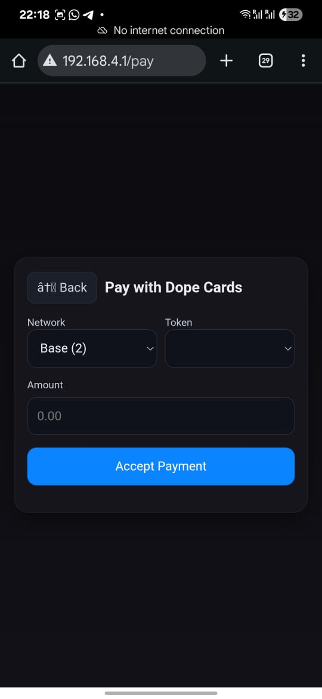
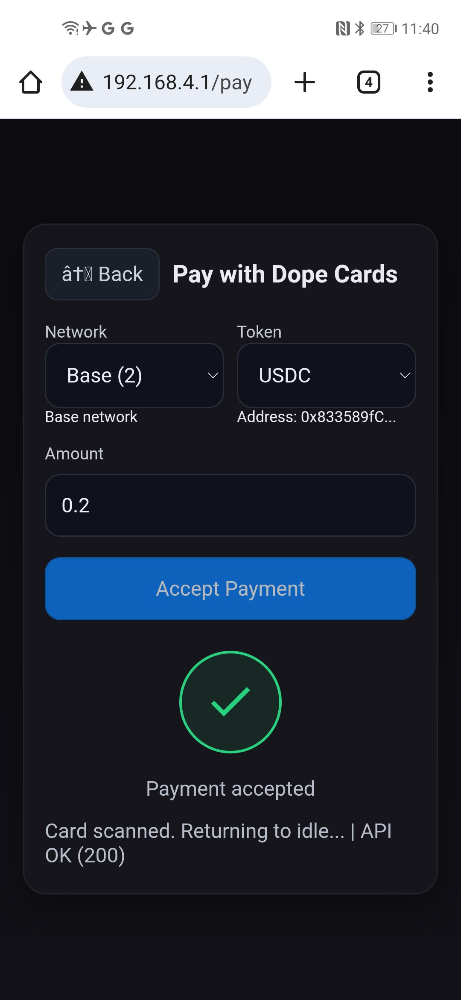
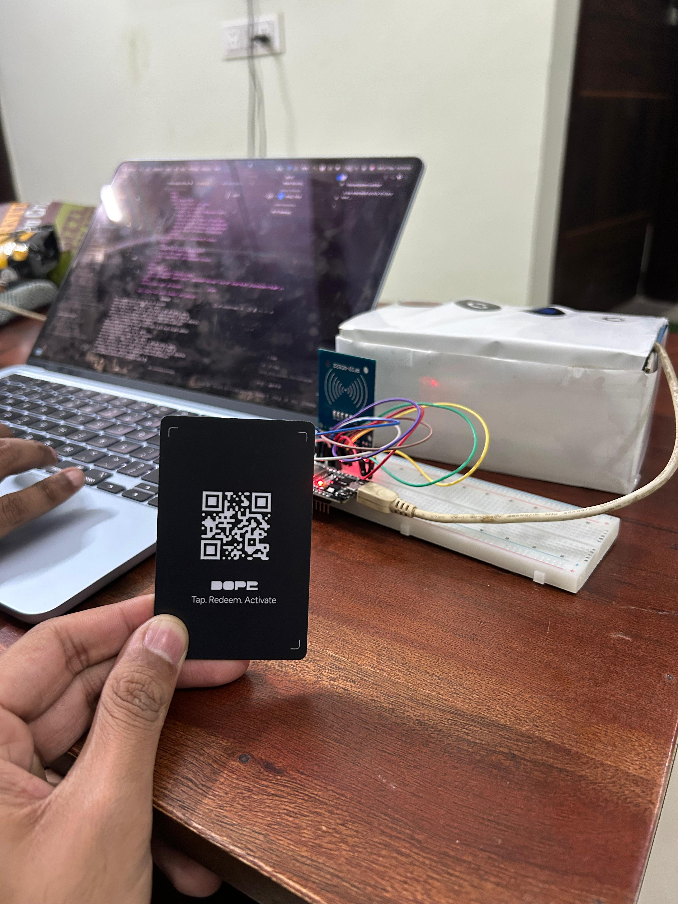
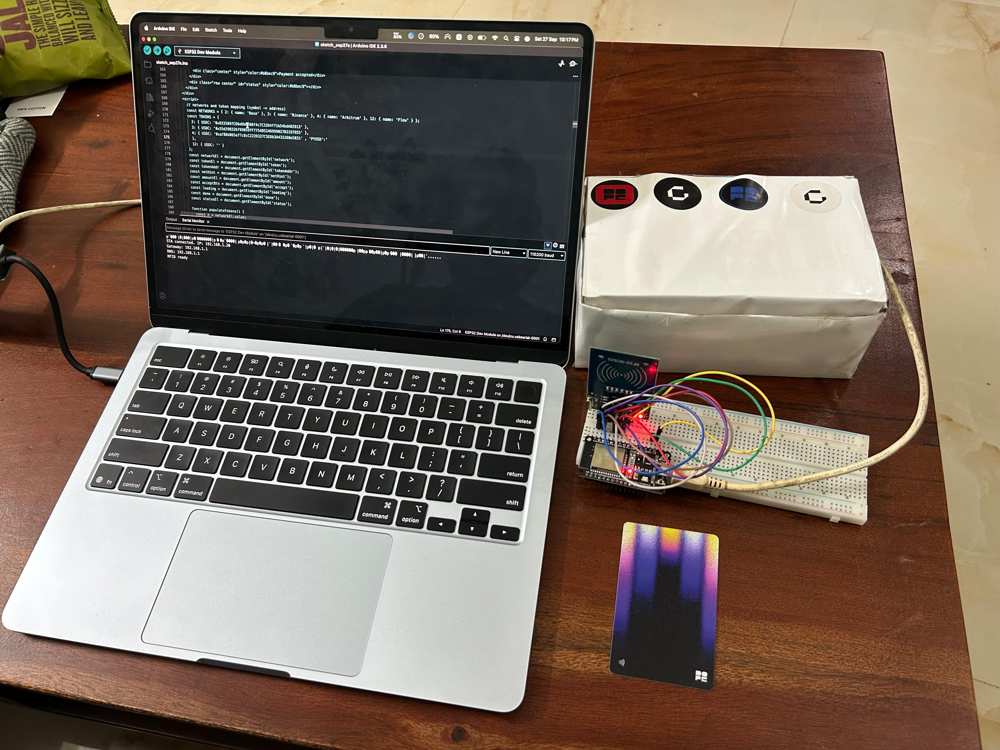
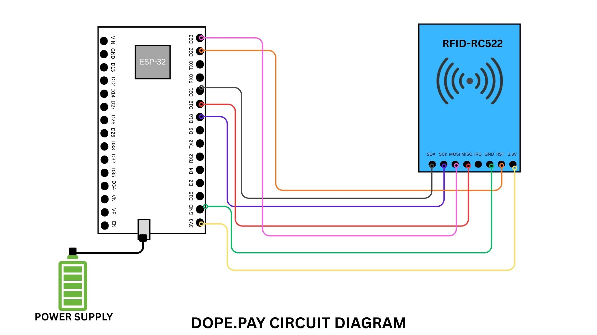

# Gasyard Cross-Chain POS Server

This repository contains the Express server that powers a cross‑chain Point‑of‑Sale (POS) flow built by Gasyard. It enables merchants to accept payments via NFC “intents” and settle funds across EVM chains in seconds using Gasyard’s intent engine.

## Description

We at Gasyard have been working on cross‑chain intents to make money movement across chains easier and frictionless. We achieved sub‑10s bridging for many EVM chains like Base, Arbitrum, Ethereum, Polygon, etc.

Here we are building a standalone POS machine to facilitate cross‑chain transactions for merchants through the intent engine developed by Gasyard.

- Choose the network you want.
- Tap the card on the machine.
- Get the balance credited in your wallet instantly.

The transaction completes in less than 5 seconds.

We have also added a feature for random donation amounts using Entropy functions from Pyth Network.

## Screenshots







## Hardware Setup

We are using an ESP32 microcontroller and an MFRC522 RFID reader, connected with jumper cables on a breadboard and powered by a 5V cable.

All of these are placed inside a cardboard box and powered by a simple power bank.







## How It Works

1. Select the destination network on the POS UI.
2. Tap the NFC card (which stores the intent ID).
3. The server validates the intent and executes the transaction on the correct chain.
4. You receive the funds in the wallet on your desired chain.

## Server Features

- Express.js API to execute intents:
  - `POST /intent/execute` → Calls `VAULT_EXECUTE_URL/api/v1/transactions/execute-intent-with-intent-id` with your payload (intentID, chainID, toAddress, tokenAddress, optional amount).
- Donation flow with randomness:
  - Integrates Pyth Entropy (via an on‑chain contract) to generate a random float for donation amounts.
- Optional Self Protocol integration (docs.self.xyz) to verify users’ identity via QR/deeplink.

## Environment

Configure these variables before starting the server:

- `PORT` (default 3000)
- `VAULT_EXECUTE_URL` (base URL of Gasyard intent API)
- `BASE_RPC_URL` (or `RPC_URL`) for on‑chain calls (Base)
- `ENTROPY_RANDOM_ADDRESS` (optional override of the on‑chain randomness contract)
- `PYTH_ENTROPY_RELAY_URL` (optional fallback randomness relay)
- Optional Self: `SELF_ENV`, `SELF_APP_ID`, `SELF_APP_SECRET`

## Install & Run

```bash
cd project-repo
npm install
npm run start
# or
npm run dev
```

Static files are served from `public/`, e.g. `http://localhost:3000/self-verify.html`.

## API

- `POST /intent/execute`
  - Body example:
    ```json
    {
      "intentID": "CmfDdFr5hx",
      "chainID": 2,
      "tokenAddress": "0x...",
      "toAddress": "0x...",
      "amount": "1.234" // optional; not included for Donate
    }
    ```

## Notes

- The ESP32 firmware reads the NFC card, extracts the intent ID, and calls this server’s API.
- Self QRCode SDK reference: https://docs.self.xyz/frontend-integration/qrcode-sdk

## License

Apache‑2.0
